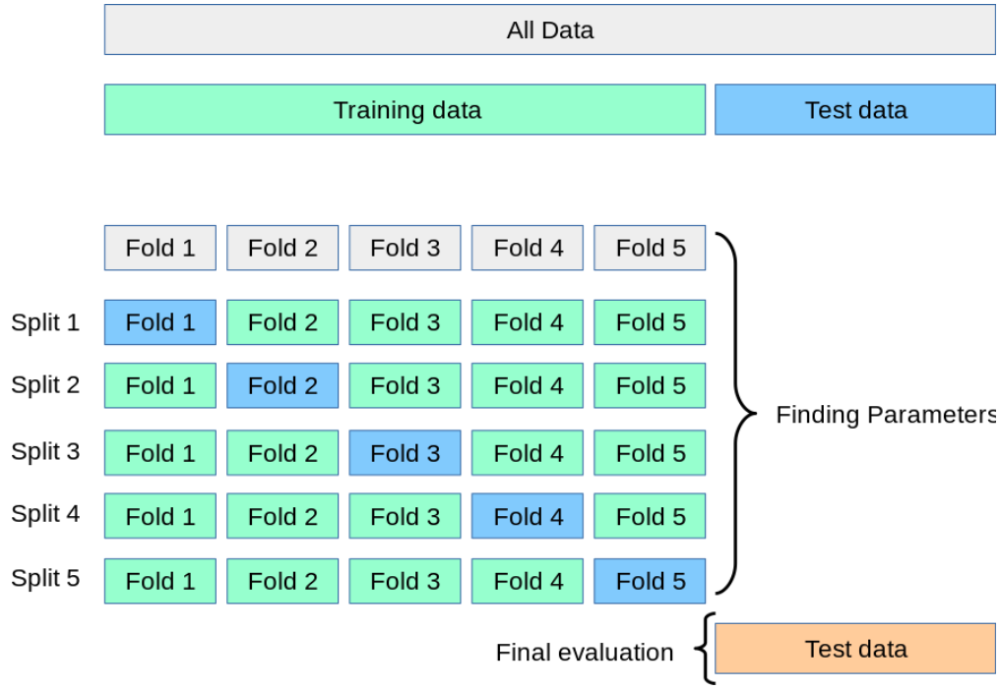

# AI Classification Tool (Ready to use)
This is a ready-to-use template for a binary classification task using various Machine Learning models. It offers fully customizable
and separated pipelines for classification task needs.

Several use cases can be supported with this template such as:
- Classify emails as either "spam" or "not spam"
- Predict whether a patient has a specific disease based on medical data
- Predict whether a borrower will default on a loan

## Features
  
### Data Processing Pipeline ([`src/processing_pipeline.py`](src/processing_pipeline.py)) fully configurable via [`config/processing_config.json`](config/processing_config.json)
1. Load and process the input data. Make sure to replace **`data/raw_data.csv`** with your own data and customize the cleaning step in ([`src/preprocessing/data_processor.py`](src/preprocessing/data_processor.py))
2. Split the preprocessed data into training and testing sets. The test set is only used during the testing pipeline to evaluate the model on unseen data, while the training set is used for training and hyperparameter tuning (see figure below).
3. Save train and test sets.
<div style="text-align: center;">
    
</div>

### Training Pipeline ([`src/training_pipeline.py`](src/training_pipeline.py)) fully configurable via [`config/training_config.json`](config/training_config.json)
- Run various AI algorithms (KNeighbors, LogisticRegression, RandomForest, XGBoost, Multi-Layer Perceptron) with **fixed hyperparameters**.
- **Cross-validation** is employed to ensure model robustness.
- Features can be selected via [`config/features.json`](config/features.json).
- Evaluate and save the models to a pickle file.
- Outputs (examples are available in the folder ([`data/outputs`](data/outputs))) : 
    * **`data/output/validation_raw_predictions.csv`** → Raw predictions across all folds.
    * **`data/output/validation_KPIs.xlsx`** → Performances metrics (Accuracy, Recall, Precision, F1-score) for each trained model.
    * **`models/trained_models.pkl`** → Saved trained models for use during the testing pipeline.

### Tuning Pipeline ([`src/tuning_pipeline.py`](src/tuning_pipeline.py)) fully configurable via [`config/tuning_config.json`](config/tuning_config.json)
- Use **Optuna** to find the best hyperparameters for multiple AI algorithms.
- Hyperparameter ranges and Optuna parameters (number of trials, scoring function, etc.) are fully customizable via the configuration file.
- Outputs : 
    * **`models/best_hyperparams.json`** → Best hyperparameters and their corresponding scores for each model.

### Testing Pipeline ([`src/testing_pipeline.py`](src/testing_pipeline.py)) fully configurable via [`config/testing_config.json`](config/testing_config.json)
- Use trained models to make predictions on unseen data (as primary train-test split was done on unique IDs).
- Calculate an aggregated prediction (mean of all model predictions).
- Evaluate predictions.
- Outputs (examples are available in the folder ([`data/outputs`](data/outputs))) : 
    * **`data/output/test_raw_predictions.csv`** → Raw predictions
    * **`data/output/test_KPIs.xlsx`** → Performance metrics (Accuracy, Recall, Precision, F1-score) for each trained model.


---

## Getting Started

### Prerequisites
Make sure you have the following installed:
- [Python](http://python.org/downloads/)

### Installation
1. Clone the repository:
    ```bash
    git clone https://github.com/Lahdhirim/ai_classification_tool.git
    cd ai_classification_tool
    ```
2. Install dependencies:
    - Python packages:
        ```bash
        pip install -r requirements.txt
        ```

---
## Running the Pipelines
There are four execution modes available. It is recommended to run them in the following order:

### Run the Processing Pipeline (Mandatory for train and test split)
```bash
python main.py process_data
```

### Run the Tuning Pipeline (Optional, but recommended for finding the best hyperparameters)
```bash
python main.py fine_tune
```

### Run the Training Pipeline (Mandatory to save the models)
```bash
python main.py train
```

### Run the Testing Pipeline
```bash
python main.py test
```
---